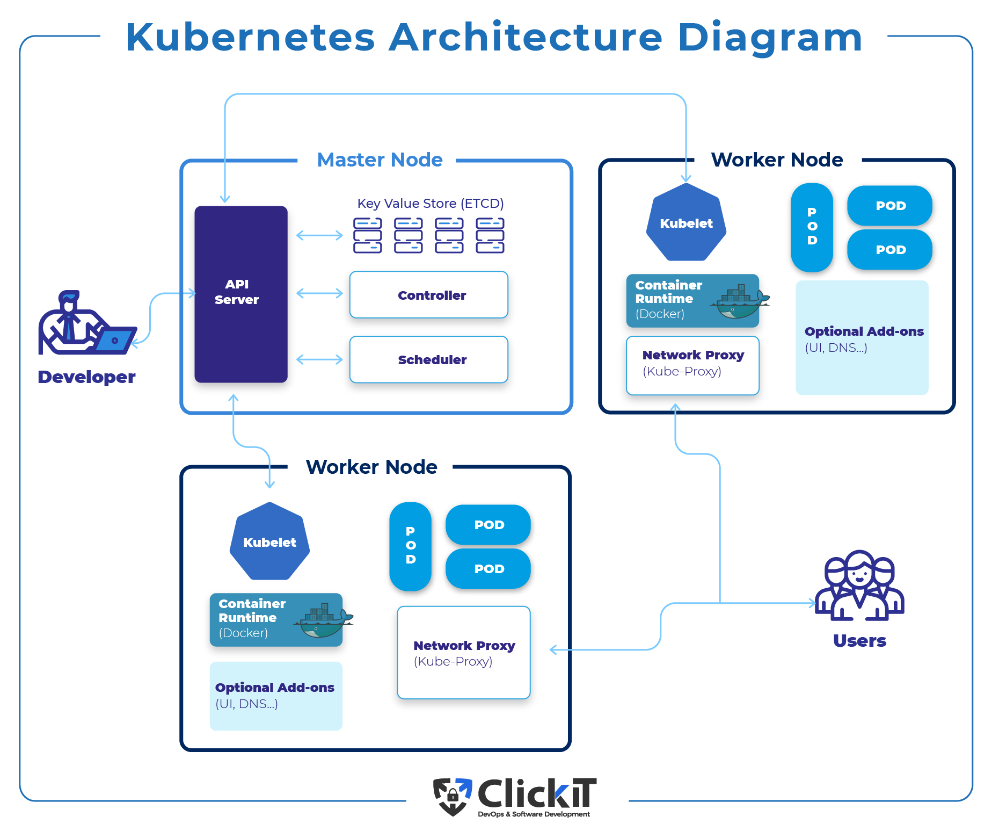

# Kubernetes

- [Kubernetes](#kubernetes)
  - [Overview](#overview)
    - [Defination](#defination)
    - [Why to use K8](#why-to-use-k8)
  - [Architecture](#architecture)
    - [- Architecture Diagram](#--architecture-diagram)
    - [- K8 workflow diagram](#--k8-workflow-diagram)
  - [K8 components](#k8-components)
    - [Deployment](#deployment)
    - [Node](#node)
    - [Pod](#pod)
    - [Service](#service)
    - [Ingress](#ingress)
    - [Volumes](#volumes)
    - [Secret](#secret)
    - [ConfigMap](#configmap)
    - [StatefulSet](#statefulset)
  - [Minikube abd Kubectl-Setup](#minikube-abd-kubectl-setup)
  - [K8 conf yam file](#k8-conf-yam-file)
  - [K8 namespaces](#k8-namespaces)
  - [K8 ingress](#k8-ingress)
  - [Helm](#helm)
  - [Volumes-Persisting Data](#volumes-persisting-data)
  - [K8 stateful set](#k8-stateful-set)

## Overview

### Defination

Kubernetes is a portable, extensible, open source platform for managing containerized workloads and services, that facilitates both declarative configuration and automation. It has a large, rapidly growing ecosystem. Kubernetes services, support, and tools are widely available.

- For more information visit **[here](https://kubernetes.io/docs/concepts/overview/components/)**
### Why to use K8

Containers are a good way to bundle and run your applications. In a production environment, you need to manage the containers that run the applications and ensure that there is no downtime. For example, if a container goes down, another container needs to start. Wouldn't it be easier if this behavior was handled by a system?

That's how Kubernetes comes to the rescue! Kubernetes provides you with a framework to run distributed systems resiliently. It takes care of scaling and failover for your application, provides deployment patterns, and more. For example: Kubernetes can easily manage a canary deployment for your system.

- Kubernetes provides you with:

> - **Service discovery and load balancing** Kubernetes can expose a container using the DNS name or using their own IP address. If traffic to a container is high, Kubernetes is able to load balance and distribute the network traffic so that the deployment is stable.

> - **Storage orchestration** Kubernetes allows you to automatically mount a storage system of your choice, such as local storages, public cloud providers, and more.

> - **Automated rollouts and rollbacks** You can describe the desired state for your deployed containers using Kubernetes, and it can change the actual state to the desired state at a controlled rate. For example, you can automate Kubernetes to create new containers for your deployment, remove existing containers and adopt all their resources to the new container.
Automatic bin packing You provide Kubernetes with a cluster of nodes that it can use to run containerized tasks. You tell Kubernetes how much CPU and memory (RAM) each container needs. Kubernetes can fit containers onto your nodes to make the best use of your resources.

> - **Self-healing** Kubernetes restarts containers that fail, replaces containers, kills containers that don't respond to your user-defined health check, and doesn't advertise them to clients until they are ready to serve.

> - **Secret and configuration management** Kubernetes lets you store and manage sensitive information, such as passwords, OAuth tokens, and SSH keys. You can deploy and update secrets and application configuration without rebuilding your container images, and without exposing secrets in your stack configuration.

## Architecture

### - Architecture Diagram

### - K8 workflow diagram

## K8 components

### Deployment

### Node

- [nodes](https://kubernetes.io/docs/concepts/architecture/nodes/)

### Pod

- [pods](https://kubernetes.io/docs/concepts/workloads/pods/)

### Service

- [service](https://kubernetes.io/docs/concepts/services-networking/service/)

### Ingress

- [ingress](https://kubernetes.io/docs/concepts/services-networking/ingress/)

### Volumes

### Secret

### ConfigMap

### StatefulSet

## Minikube abd Kubectl-Setup

## K8 conf yam file

## K8 namespaces

## K8 ingress

## Helm

## Volumes-Persisting Data

## K8 stateful set