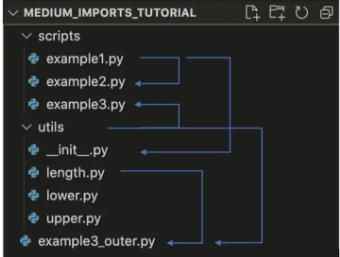

---
hide:
  - navigation
  - tags
---
 
- [Grab the Python stuff here ...😉](#grab-the-python-stuff-here-)
    - [use of __init__.py file](#use-of-initpy-file)
    - [args and kwargs](#args-and-kwargs)
    - [magic methods](#magic-methods)
    - [isinstance](#isinstance)
    - [decorator](#decorator)
    - [Lambda](#lambda)
    - [Filter](#filter)
    - [Mapping](#mapping)
    - [List Comprehension](#list-comprehension)
    - [read and write](#read-and-write)
    - [dataclass](#dataclass)
    - [logging](#logging)
    - [regex](#regex)


# Grab the Python stuff here ...😉

Usage doc is to state syntax for builtin funct. and modules

##Builtin or Modules

### use of __init__.py file

__init__.py is used t import packages from a particular directory



```
Module: A single python script.

Package: A collection of modules. (for eg: directory in which all py files contains)
```

click [here](https://towardsdatascience.com/understanding-python-imports-init-py-and-pythonpath-once-and-for-all-4c5249ab6355) for the documentation for usage of init file.

### args and kwargs

- In Python, we can pass a variable number of arguments to a function using special symbols. There are two special symbols:

1. *args (Non Keyword Arguments)

2. **kwargs (Keyword Arguments)

- We use ***args and **kwargs as an argument when we are unsure about the number of arguments to pass in the functions.

### magic methods

```
num=10
num + 5
15
num.__add__(5)  ##magic method __add__
15
```

click [here](https://www.tutorialsteacher.com/python/magic-methods-in-python) for more magic method

### isinstance

The isinstance() function returns True if the specified object is of the specified type, otherwise False
 
- syntax
```
isinstance(object, type)
```

### decorator

- decorators allow you to change the behavior of a function without modifying the function itself.
 
- syntax
```
def my_decorator_func(func):

    def wrapper_func():
        # Do something before the function.
        func()
        # Do something after the function.
    return wrapper_func

#using decoarate

@my_decorator_func
def my_func():
    pass

```

### Lambda

lambda basic form
 
- lambda (parameters):(return_Val)

- lambda x,y:x+y

Value will return automatically
 


- lambda is used to avoid a small function
so that it can be placed in one line

### Filter
 
Filtering in python (which is similar to mapping)

- Syntax
```
filter(some_function,my_list)
```


### Mapping

Mapping is to map the values with respt. parameters

- Syntax
```
map(some_function,my_list)
```

- for eg: mapping the dict. Key and vlaues
 


- Mapping is used by calling it on the List and passing it some function


### List Comprehension
 
the simply readable way of transforming elements in list either by mapping or filtering
 
- List Comprehension Syntax for Mapping

```
var = class_type({return_value} {for loop})
```

- List Comprehension Syntax for Filtering

```
var = class_type({return_value} {for loop} {condition})
```
### read and write

- syntax
```
f = open({file_path},{file_mode})
```

### dataclass
 
- this module define classes that only act as data containers and when we do that, we spend a consequent amount of time writing boilerplate code with tons of arguments, an ugly __init__ method and many overridden functions.
 
- When you use dataclasses, you first have to import dataclass and then use it as a decorator before the class you define.

- syntax
```
from dataclasses import dataclass   ##import dataclass

@dataclass
class Book:

    title : str    ###variables are define without using __init__ instance
    author : str
    price : float

book=Book("title","author",price)
print(book.price)           ###print values
```
### logging

- Logging is a means of tracking events that happen when some software runs. The software’s developer adds logging calls to their code to indicate that certain events have occurred.Due to this logging method, the record of events can be saved unlike print which only displays the content in console.

different level of logging, also logging methods should be in following order:

1. Basic logging method
```
logging.debug('debug')
logging.info("info")
logging.warning('warn')
logging.error('error')
logging.critical('critical')
```

2. Logging with configuration
```
import logging
logging.basicConfig(level=logging.INFO, filename="{filename.log}",filemode="w",
                    format="%(asctime)s - %(levelname)s - %(funcName)s - %(lineno)s - %(message)s")  ##funcname display the actual fnction name
```

### regex
- The re module offers a set of functions that allows us to search a string for a match:

most used modules in regex are :

Function	Description

1. findall > Returns a list containing all matches ##returns all matched searched elements

2. search > Returns a Match object if there is a match anywhere in the string

3. split > Returns a list where the string has been split at each match

4. sub > Replaces one or many matches with a string

5. finditer > 


