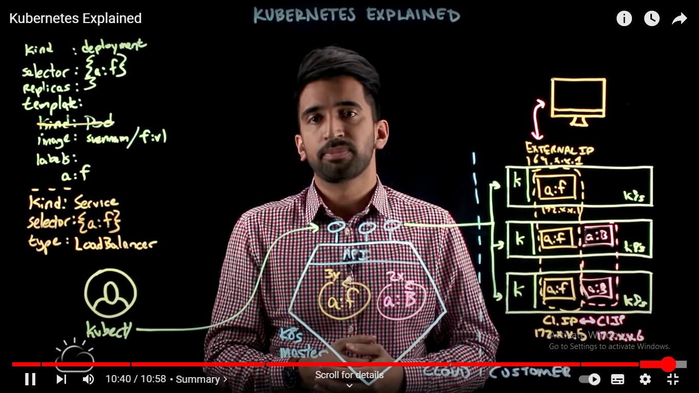

## Karthik Gaekwad linkedin > Getting started with kubernetes

# Microservices  ...?

Microservices are a software development approach that structures an application as a collection of small, independent services that are loosely coupled and can be deployed and scaled independently. In this architecture, each service is responsible for a specific task or set of tasks, and communicates with other services through well-defined APIs.

## Common Microservices Patterns
### 12 The Twelve-Factor App (this methodology help to get for microservices paltform)
1. Codebase

Codebase must be tracked in Version Control and will have many deploys.

2. Dependencies

Instead of copy/pasting , Consider reusable of functions or shared libraries
 
3. Configurations

To store configuration in the environment.

Configurations intregration should never go into the Source Code , it should be part of the environment.

Add configuration via environment variables or config files.

4. Backend Storage Service

Eg : SQL database , Email server

Must be attached for storage and easy in deploy and change

5. Build, Release and Run 

DEVOPS part

6. Processes

Execute the application as stateless process.

7. Port Bindings

Services should be expose with port bindings.

8. Concurrency

Scale out with process model.

9. Disposability

Quick application startup and shutdown times

10. DEV/PROD parity

Application should treated the same way in dev staging or production staging

11. Log Management

Should be able to debug and maintain logs

12. Admin Tasks

Treated the same way in like the rest of the application

Are allowed to run against a released version

# K8 architecture 

# Cloud Native ...?

Cloud Native technologies empowers organizations to build and run scalable applications in modern and dynamic environments such as public, private and hybrid cloud.

Containers, service meshes, microservices, immutable infrastructure and declarative APIs exemplify this approach.

# Minikube 

Minikube is a lightweight Kubernetes implementation that creates a VM on your local machine and deploys a simple cluster containing only one node. Minikube is available for Linux, macOS, and Windows systems.

# Cluster

A Kubernetes cluster is a set of nodes that run containerized applications. Containerizing applications packages an app with its dependences and some necessary services. 

# Nodes

A Node is a worker machine in Kubernetes and may be either a virtual or a physical machine, depending on the cluster. Each Node is managed by the control plane. A Node can have multiple pods, and the Kubernetes control plane automatically handles scheduling the pods across the Nodes in the cluster.

# Namespaces

Namespaces are a way to organize clusters into virtual sub-clusters — they can be helpful when different teams or projects share a Kubernetes cluster. Any number of namespaces are supported within a cluster, each logically separated from others but with the ability to communicate with each other.
A Kubernetes namespace provides the scope for Pods, Services, and Deployments in the cluster. Users interacting with one namespace do not see the content in another namespace

# Services

A Kubernetes Service is an abstraction layer that defines a logical set of Pods (a group of one or more containers) and a policy for accessing them. In other words, a Kubernetes Service is a way to expose an application running on a set of Pods as a network service.

Kubernetes Services allow you to decouple your application from the network by providing a stable IP address and DNS name that can be used to access the application. This allows you to deploy your application in a distributed, scalable way, without having to worry about the underlying network infrastructure.

# to start with

Download Minikube install exe file

minikube documentation
https://minikube.sigs.k8s.io/docs/start/

## minikube commands

to create a minikube cluster

> minikube start

explore and check the cluster

> kubectl cluster-info

to get detail about the cluster

> kubectl cluster-info dump

to check nodes/worker

> kubectl get nodes

check k8 namespace

> kubectl get namespaces

> kubectl get ns

check k8 pods

> kubectl get pods

> kubectl get pods -A  #-A to check pods in every namespace

check k8 services

> kubectl get services

> kubectl get services -A

create a new namespace using namespace.yaml file

> kubectl apply -f namespace.yaml

delete a namespace

> kubectl delete -f namespace.yaml

create a deployment using deployment.yaml file

> kubectl apply -f deployment.yaml

to check deployment with namespace

> kubectl get deployments -n "namespace"  #kubectl get deployments -n development

check pods for particular namespace

> kubectl get pods -n "namespace"   #kubectl get pods -n development 

Note: namespace is provide in namespace.yaml

delete pods with particular namespace

> kubectl delete pod "pod-name" -n "namespace" #get podname with kubectl get pods -n "namespace"

Note : after deleting the pod, immediately it will create a new pod because in yaml we give replicas as 3

check logs of pods

> kubectl describe pod "pod-name" -n "namespace"

## install busybox with yaml file

Use busybox to test the application can accept traffic from inside the container

> kubectl apply -f busybox.yaml 

to check the busybox installation

> kubectl get pods

IP address of pods , in order to make a request

> kubectl get pods -n "namespace" -o wide

Note : -o wide provides more details about pod along with IP address

Execute commands in container/ interact with container

> kubectl exec -it "pod-name" -- /bin/sh

Inside the busybox container
1. verify with command "wget"

2. in new cmd copy the ip address of any of the one pod, using the following command 

> kubectl get pods -n "namespace" -o wide

3. in busybox container

> wget "ip-address"

Note : you may get error as

> Connecting to 10.244.0.5 (10.244.0.5:80)
> wget: can't connect to remote host (10.244.0.5): Connection refused

In the error ip address is connected with port 80 and in deployment.yaml we mentioned different port numbers , use the port number and follow the below command

> wget "ip-address":"port-number"    #wget 10.244.0.5:3000

> cat index.html  #you can see configuration with pod name

> exit

View application logs

> kubectl get pods -n "namespace"  # list all pods in particular namespace

> kubectl logs "pod-name" -n "namespace"

create a service using service.yaml

Minikube Tunnel start

> minikube tunnel

install service yaml

> kubectl apply -f service.yaml

find the external ip address to verify the request

> kubectl get services -n "namespace"

Note : it will display along with interna and external ip address 

click on external ip address to visit webpage.
